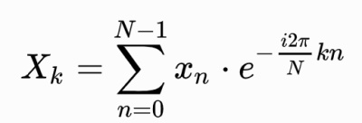
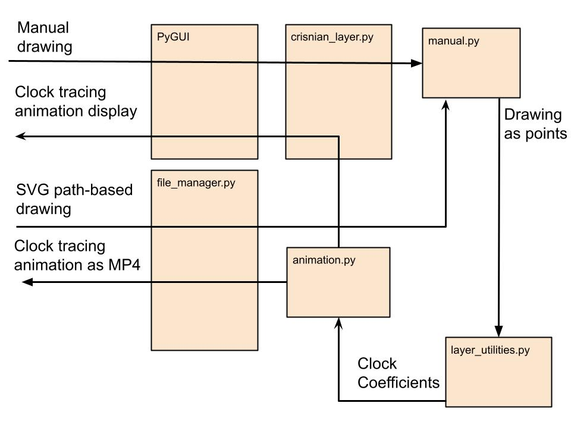

# Crisnian V1.0

+ Crisnian is a software that retraces drawings using stacked clocks
+ It determines what clocks to use using complex Fourier analysis
+ It supports both manual drawing using different colors/brush sizes and importing drawings as path-based SVG files
+ It also supports exporting clock retracing animations as MP4 videos

## Sample

## User guide
+ Step 1: Create your drawing
    + You can use the brush/eraser tools to manually make a drawing on the canvas with different brush colors/sizes
    + You can also clear the canvas with the clear button or hide your drawing with the hide button
    + You can also import a drawing as a path-based SVG file using the import button
    + You can convert your jpg/png drawings to path-based SVGs using https://www.pngtosvg.com/ or Adobe illustrator
+ Step 2: Create your animation
    + Use the clock button at the top left to choose your animation speed. Next to it is displayed the length of the animation
    + Press the render button and wait till it reaches 100% (this step can be long if you have a large drawing)
+ Step 3: Create your output
    + You can use the play/pause/restart buttons to watch the clock tracing animation on screen
    + You can also export the clock tracing animation as an MP4 file using the export button
    
## Fourier Analysis
(Complex) Fourier Analysis is a field of mathematics dedicated to writing complex functions as sums of complex exponentials
Any complex function that meets certain criteria can be written over an interval as a weighted sum of complex exponentials:

The coefficients for this sum can be obtained with the following formula:

In the case of this software, the drawing that is retraced is modeled as a complex function
Fourier Analysis is used on the drawing to compute the coefficients for its Fourier sum
The exponential terms are effectively spinning vectors or clocks which sum up to the drawing at their tip
Because the drawings are stored as sets of points, they do not form continuous functions, so we are actually using discrete Fourier analysis:

## Code structure

## Code logic
+ GUI
    + Crisnian's GUI was built using a modified version of PyGUI, a library I made to make layer/object-based GUIs with PyGame
    + https://github.com/Aymane-Aeris-El-Asslouj/PyGUI
    + Crisnian_layer is the only layer and it contains all the user interface elements along with the software's objects
    + It also displays the manual drawings and animations
+ Drawing
    + Manuals drawings are stored as a list of complex points paired with a font color/size in a Manual object
    + Importing of SVGs is handled by a File Manager object which transforms curves into a list of points
+ Animation
    + The Animation object uses Fourier analysis from layer_utilities.py to find Fourier coefficients for the drawing points modeled as a complex function
    + The Animation object creates the animation by drawing the Fourier terms arrows within circles stacked to point to the drawing point
    + Each frame of the animation corresponds to a different drawing point and all frames are stored in a list
+ Exporting
    + The File Manager object saves the frames as temporary jpegs which are then written into an MP4 file